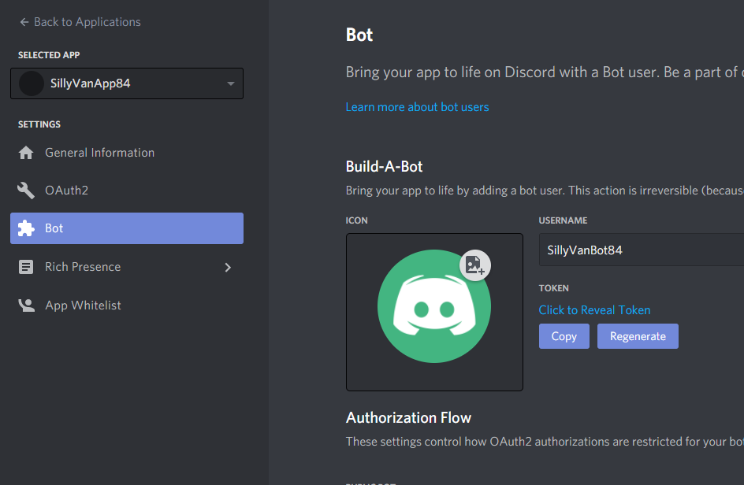

# AnpaBot

Open Source bot for Atlantic Gaming

## Entry point

To run the bot just run `python worker.py` directly, or use the `sh scripts/run.sh`

## Requirements

To run the bot it's needed to register an application and bot in Discord via the Developer Portal.
Also it rely on PostgreSQL for data persistence.

The configuration is loaded via environment variables, which can be set with local `.env` file or on the server as per your hosting solution.

### Discord Bot Token

The `DISCORD_TOKEN` env var is required and can be obtained from the Developer Portal of Discord, under the section Bot.

### Postgres Database URL

The `DATABASE_URL` env var is require to persist data, and should be in the format `postgresql://[user[:password]@][host][:port][/dbname]`

## Server hosting

The bot is configure to run on heroku using a worker, you can see the `Procfile` for the command.
